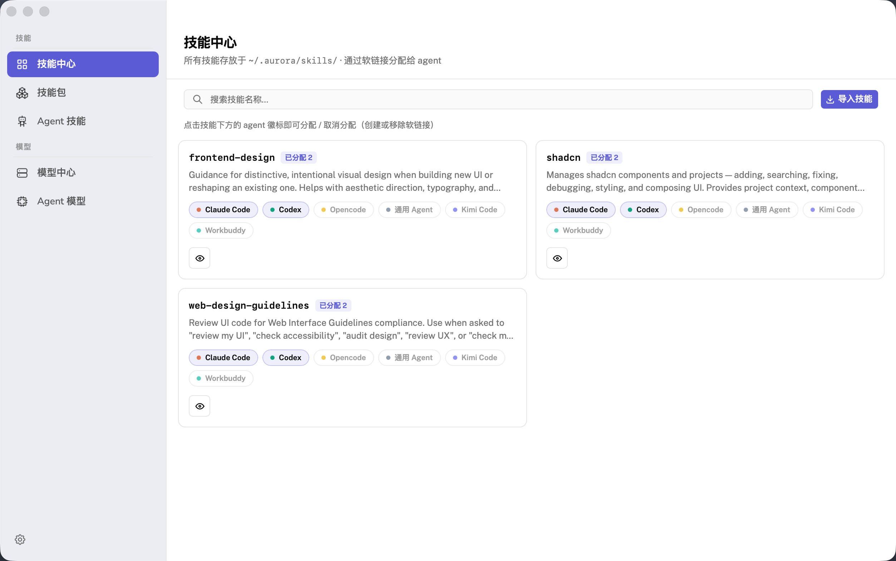
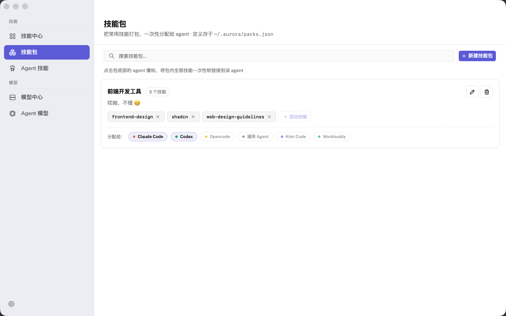
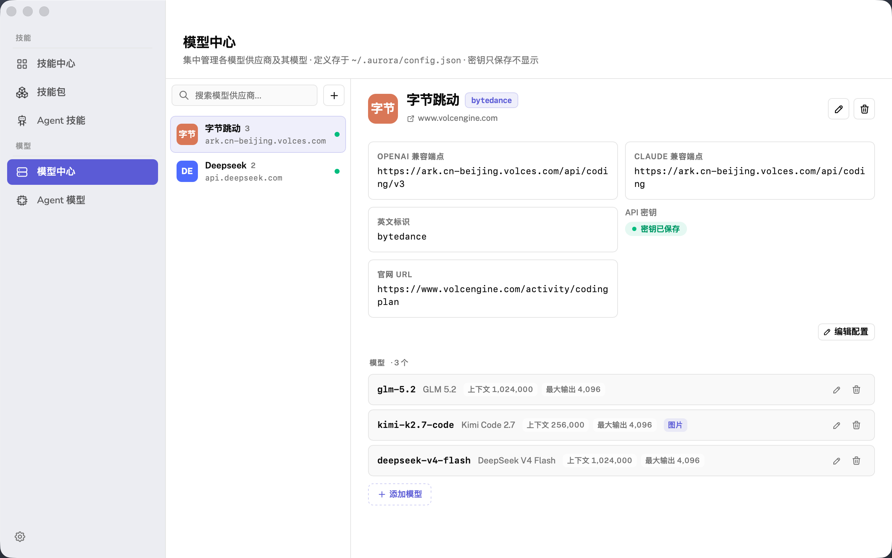

# Aurora

> 统一管理 AI agent 技能的桌面应用 —— 集中存储、打包、分配,跨 Claude Code / Codex / Kimi Code / Opencode 等 agent。


<p align="center">
  
</p>

## ✨ 功能特性

- **技能中心**:集中管理所有技能,每个含 `SKILL.md`。支持搜索、原文/中文切换查看(按需机翻并缓存)、删除,以及从 GitHub 仓库 / 任意 URL / 本地目录 / 粘贴 Markdown 四种方式导入
- **技能包**:把多个技能打包,一键分配给多个 agent;包内增删技能时,已分配的 agent 自动同步(加技能即建软链接,删技能即清软链接,且不误删其它包共享的同名链接)
- **Agent 技能**:按 agent 查看其技能,区分「技能中心软链接 / 真实目录 / 外部软链接」三种来源;删除只清技能中心创建的软链接,真实目录与外部链接受保护;外部技能可一键导入中心
- **模型中心**:管理 provider(端点 / 密钥 / 多模型)与各 agent 的翻译模型 / 对话模型配置,密钥只存不显
- **跨平台链接**:macOS/Linux 用符号链接,Windows 用 junction(无需管理员或开发者模式)

## 📸 界面预览

| 技能中心 | 技能包 |
|---|---|
|  |  |

| Agent 技能 | 模型中心 |
|---|---|
|  |  |

| Agent 模型 |
|---|
|  |

## 📥 下载安装

前往 [Releases](https://github.com/zhihui/Aurora/releases) 下载对应平台的安装包:

| 平台 | 安装包 |
|------|--------|
| macOS(Apple Silicon / Intel) | `.dmg` |
| Windows | `.msi` / `.exe` |
| Linux | `.deb` / `.AppImage` |

> 也可从源码构建,见下方「开发」。

## 🚀 快速开始

1. 启动 Aurora,在「设置」中确认或添加你的 agent
2. 在「技能中心」通过 GitHub / URL / 本地导入技能,或直接粘贴 Markdown 新建
3. 点击技能卡片上的 agent 徽标,把技能以软链接形式分配给 agent
4. 或用「技能包」打包多个技能,一键分配给多个 agent

## 🤖 支持的 Agents

| Agent | 技能目录 |
|-------|----------|
| Claude Code | `~/.claude/skills/` |
| Codex | `~/.codex/skills/` |
| Kimi Code | `~/.kimi-code/skills/` |
| Opencode | `~/.config/opencode/skills/` |
| 通用 Agent | `~/.agents/skills/` |

## 📁 数据位置

所有数据存于 `~/.aurora/`:

| 路径 | 说明 |
|------|------|
| `skills/<name>/` | 技能中心 |
| `packs.json` | 技能包配置 |
| `config.json` | 应用配置 |
| `cache/` | 导入暂存 / 翻译缓存 / 更新检查缓存 |

## 🛠 开发

**前置**:Node.js 20+、pnpm、Rust(stable),以及各平台系统依赖:

<details>
<summary>各平台依赖</summary>

- **macOS**:`xcode-select --install`
- **Windows**:[Visual Studio Build Tools](https://visualstudio.microsoft.com/downloads/)(含 "Desktop development with C++" 工作负载,无需管理员/开发者模式)
- **Linux**(Debian/Ubuntu):
  ```bash
  sudo apt install libwebkit2gtk-4.1-dev build-essential curl wget file libssl-dev libayatana-appindicator3-dev librsvg2-dev
  ```

</details>

```bash
pnpm install        # 安装依赖
pnpm tauri dev      # 开发(前端热更新,Rust 改动自动重编译)
pnpm tauri build    # 生产构建(产物在 src-tauri/target/release/bundle/)
```

## 📦 发版

推送 `v*` 标签触发 [`.github/workflows/release.yml`](.github/workflows/release.yml):macOS(aarch64 + x86_64)、Linux、Windows 四平台并行构建,产物上传到 GitHub Release(草稿态,手动发布)。

```bash
git tag v0.1.6
git push origin v0.1.6
```

## 📄 License

[MIT](LICENSE)
